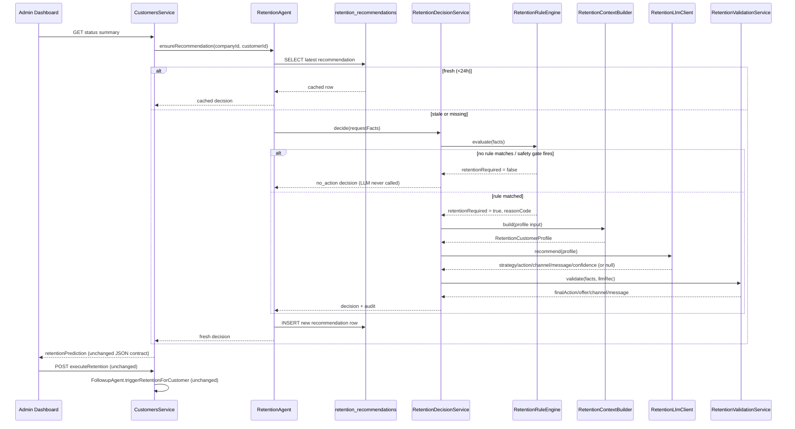

# Retention Agent: Rule-Based + LLM Redesign

This document describes the replacement of the CRM's retention decision-making
with a **Rule Engine → LLM → Validation** pipeline. It supersedes the ML-model
section of `docs/retention-agent.md` for the live CRM path. The standalone
Python bandit/model agents (`agent/retention_agent.py`,
`services/ai/agents/retention_agent.py`) are untouched and still documented
there — this redesign only changes what feeds `CustomersService.getStatusSummary()`
and the admin dashboard's retention suggestion card.

## Why

`docs/retention-agent.md` (Step 18, "Implementation Gaps") already noted that
CRM never actually called the model-backed Python `RetentionAgent` —
`computeRetentionPrediction()` in `customers.service.ts` used inline
threshold rules dressed up as `pConvert`/`ltv`/`churnProbability` (churn
probability came from the real churn-service model; `pConvert` was borrowed
from upsell confidence; `ltv` was `avgMonthlySpend * 12`). There isn't enough
labeled retention-outcome data yet to train real conversion/LTV/churn models
for this decision, so rather than wire up the disconnected `.pkl`-based
pipeline, we replace the decision logic with business rules + an LLM, and log
every decision so a future ML model has real training data to learn from.

## 1. Updated architecture

```
                        ┌─────────────────────────────┐
                        │   CustomersService           │
                        │   .getStatusSummary()         │
                        └──────────────┬───────────────┘
                                       │ ensureRecommendation(companyId, customerId)
                                       ▼
                        ┌─────────────────────────────┐
                        │   RetentionAgent              │  apps/crm-service/src/agents/retention.agent.ts
                        │   (cache-aside, 24h TTL)       │
                        └──────────────┬───────────────┘
                                       │ cache miss → generateRecommendation()
                                       ▼
                        ┌─────────────────────────────┐
                        │ RetentionDecisionService      │  orchestrator
                        └──────────────┬───────────────┘
                     ┌─────────────────┼─────────────────┬───────────────────┐
                     ▼                 ▼                 ▼                   ▼
           RetentionRuleEngine  RetentionContext   RetentionLlmClient  RetentionValidationService
           (whether + why)      Builder (profile)  (strategy/offer/    (policy + safety gate,
                                                      channel/message)   final say)
                                       │
                                       ▼
                        ┌─────────────────────────────┐
                        │ retention_recommendations     │  feedback log / cache row
                        │ (Postgres, crm schema)        │
                        └──────────────┬───────────────┘
                                       │ read by dashboard
                                       ▼
                  admin-dashboard: Customers.tsx, CustomerDetailsSidebar.tsx
                  (unchanged — same retentionPrediction JSON contract)
                                       │
                                       │ manual "Execute" action
                                       ▼
                        CustomersService.executeRetention()
                                       │ (unchanged)
                                       ▼
                        FollowupAgent.triggerRetentionForCustomer()
                                       │ (unchanged)
                                       ▼
                  FollowupProducer → comms-service (SMS/email) — existing pipeline
```

Nothing left of `RetentionDecisionService` in the diagram changes: CRM APIs,
the dashboard, the `executeRetention` → `FollowupAgent` → comms-service
notification pipeline, and the database schema (aside from one additive
table) are all untouched.

## 2. New classes/modules

All under `apps/crm-service/src/retention/` (mirrors the already-shipped
`apps/crm-service/src/followup/` rule+LLM pattern on this branch — same shape,
applied to a different decision):

| File | Responsibility |
|---|---|
| `rules/retention-rule-engine.ts` | Pure function: facts → `{ retentionRequired, reasonCode, reason }`. No I/O. |
| `context/retention-context-builder.ts` | Raw CRM signals → `RetentionCustomerProfile` (the only shape the LLM ever sees). |
| `../ai/retention-llm.prompt.ts` | System prompt + user-prompt builder. |
| `../ai/retention-llm.client.ts` | Calls OpenAI, validates the JSON shape, returns `null` on any failure. |
| `validation/retention-validation.service.ts` | Re-checks every LLM field against ground truth + company offer policy. Final say. |
| `decision/retention-decision.service.ts` | Orchestrates the above four, in that fixed order. Always returns a decision (never null — `no_action` is a valid, expected outcome). |
| `retention.module.ts` | NestJS wiring. |
| `../agents/retention.agent.ts` | Cache-aside layer: reads/writes `retention_recommendations`, derives rule facts from Prisma, applies the 24h TTL. |

## 3. Modified execution flow

**Before:** `getStatusSummary()` called `computeRetentionPrediction()`
synchronously; the "action" came straight from a threshold formula on
`pConvert`/`ltv`/`churnProbability`.

**After:** `getStatusSummary()` calls `retentionAgent.ensureRecommendation(companyId, id)`
(one `await`, same place existing churn-service and upsell calls already
happen). That method:

1. Reads the latest `retention_recommendations` row for the customer.
2. If it's under 24h old, returns it directly — **no rule re-evaluation, no LLM
   call** on the common path (a dashboard view is not the place to pay LLM
   latency/cost).
3. Otherwise pulls fresh signals from Prisma (bookings, agreements, equipment,
   reviews) and calls `RetentionDecisionService.decide()`:
   - Rule engine evaluates safety gates + business rules. If no rule matches,
     the LLM is **never called** (verified by test — see
     `retention-decision.service.spec.ts`).
   - Context builder produces the structured profile.
   - LLM proposes strategy/offer/priority/channel/message/confidence.
   - Validation re-checks everything and has final veto power.
4. Persists the decision as a new row (audit trail) and returns it.

`computeRetentionPrediction()` still exists, but now does two things: (a)
computes the informational `pConvert`/`ltv`/`churnProbability`/`score` numbers
still shown on the reasoning card, and (b) merges in the agent's decision when
available, or falls back to a **rule-only** version of the same thresholds
(no LLM) if the migration hasn't run yet or the customer lookup fails — so
the dashboard never sees a broken or missing `retentionPrediction`.

`executeRetention()` and `FollowupAgent.triggerRetentionForCustomer()` are
byte-for-byte unchanged — reused per the "no changes required there" instruction.

## 4. Updated TypeScript interfaces

Added to `packages/types/src/index.ts` (full listing there): `RetentionAction`,
`RetentionChannel`, `RetentionPriority`, `RetentionCustomerSegment`,
`RetentionRuleReasonCode`, `RetentionRuleFacts`, `RetentionRuleResult`,
`RetentionCustomerProfile`, `RetentionLlmRecommendation`,
`RetentionDecisionAudit`. Intentionally a separate type family from
`Followup*` — retention offers have a distinct output contract (`offer.type`/
`discount`, commercial `priority`/`score`) that the admin dashboard already
renders (`apps/admin-dashboard/src/types/api.ts`), and mixing the two would
blur two different questions ("should we message this person?" vs "should we
offer this person money off?").

`RetentionLlmRecommendation.action` is deliberately a constrained enum
(`premium_contract_offer | discount_retention_offer | maintenance_plan_offer |
no_action`), not free text — the LLM picks from the company's approved offer
catalog, it does not invent one. This is what makes the "offer allowed by
company policy" validation check meaningful rather than a fuzzy string match.

## 5. Rule Engine implementation

`apps/crm-service/src/retention/rules/retention-rule-engine.ts`. Safety gates
run first and short-circuit everything else:

1. Customer opted out (`automaticFollowupEnabled === false`) → No Action.
2. Previous retention attempts ≥ configured limit (3) → No Action.
3. No contact channel at all → No Action.

Then, in priority order:

4. **Customer Complaints** (≥2 low ratings/complaints) → retention required,
   `highPriority: true`. Checked first because dissatisfaction is the
   costliest signal to ignore.
5. **Maintenance Agreement expired** (status `EXPIRED` or `endDate` in the
   past) → retention required.
6. **Frequent Repairs** (≥3 service visits in trailing 12 months) → retention
   required.
7. **High Value Customer** (premium segment AND annual spend above the
   configured threshold AND declining engagement trend) → retention required.
8. **Inactive Customer** (>180 days since last service) → retention required.
9. Otherwise → No Action, reason `"Customer does not meet retention targeting thresholds"`.

13 unit tests in `retention-rule-engine.spec.ts` cover every gate and rule,
including boundary conditions (exactly-at-limit, exactly-at-threshold) and
rule precedence (complaints beat frequent repairs when both apply).

## 6. Customer Context Builder

`apps/crm-service/src/retention/context/retention-context-builder.ts`. Takes
raw CRM signals (never a Prisma row) and produces exactly the structured
profile the LLM is allowed to see:

```ts
{
  customerName, customerSegment, annualSpend, equipmentAge,
  maintenanceAgreementStatus, daysSinceLastService, repairCount,
  complaintCount, preferredCommunication, previousRetentionAttempts,
  activeContracts, notes, reasonCode, reason,
}
```

Throws if called with a rule result where `retentionRequired` is false — the
caller (decision service) guarantees this never happens, it's a programmer-error
guard, matching `FollowupContextBuilder`'s existing convention.

## 7. LLM prompt template

`apps/crm-service/src/ai/retention-llm.prompt.ts`. The system prompt makes
explicit that the LLM does not decide *whether* to retain — only *how* — and
constrains `action` to the four-value enum, `channel` to
`whatsapp|email|call`, `message` to <320 chars with no invented discount
percentages, and requires calibrated `confidence`. Output is forced JSON-only
via `response_format: { type: 'json_object' }` on the OpenAI call (see
`retention-llm.client.ts`), plus a runtime shape check (`isValidRecommendation`)
before the result is trusted at all — anything malformed returns `null` and
the pipeline falls back to a rule-only decision rather than throwing.

## 8. Validation module

`apps/crm-service/src/retention/validation/retention-validation.service.ts`.
Checks, exactly per spec:

- **Not opted out** (`automaticFollowupEnabled`) — blocking.
- **Attempt limit not exceeded** — blocking.
- **Offer allowed by company policy** — the LLM's `action` is looked up in a
  static `OFFER_POLICY` map (the same premium/discount/maintenance/none
  mapping the old code hardcoded); anything outside it is rejected.
- **Same offer not recently sent** (`sameOfferRecentlySent`, checked by the
  agent against `retention_recommendations` in the last 30 days) — blocking.
- **Channel exists** — if the LLM's requested channel has no matching contact
  field, this is *not* a blocking failure by itself: the validator silently
  substitutes an available channel (this is a deliberate improvement over the
  already-shipped `FollowupValidationService`, where any failed check —
  including a recoverable channel substitution — suppresses the entire
  decision; here only "no channel at all" blocks).
- If the LLM was unavailable (`null`), or any blocking check fails, the
  method still returns a fully-formed result with `finalAction: 'no_action'`
  — validation never throws, and the decision service never needs to handle
  an exception from this layer.

11 unit tests cover each check plus the offer-policy lookup and the
channel-substitution-is-non-blocking distinction.

## 9. Database changes

One additive table, no changes to existing ones:

```prisma
model RetentionRecommendation {
  id, companyId, customerId
  ruleResult Json, llmRecommendation Json?, validationResult Json
  finalAction, finalOffer Json, finalPriority, finalChannel?, finalMessage?
  reason, confidence?, status ("generated" | "actioned" | "superseded")
  managerOverride Json?, customerAccepted Bool?, customerDeclined Bool?,
  retentionSuccess Bool?, revenueGenerated Decimal?, respondedAt?
  createdAt, updatedAt
}
```

Mirrors the existing `UpsellRecommendation` table's cache-aside shape and adds
the outcome columns Step 6 (Feedback Logging) asks for. Migration:
`apps/crm-service/prisma/migrations/20260716120000_add_retention_recommendations/`.
Accessed via the same defensive `tableExists()`/raw-SQL pattern
`FollowupAgent` already uses for `followup_attempts` — if the migration
hasn't run in an environment yet, the agent degrades to the rule-only
fallback instead of throwing.

`managerOverride`/`customerAccepted`/`customerDeclined`/`retentionSuccess`/
`revenueGenerated` are columns only for now — there's no UI wired to set them
yet, matching the fact that `upsell_recommendations` has the same read-only
posture today. Wiring an accept/decline action is a natural next step but
would mean adding a new endpoint, which is out of scope for "preserve
existing APIs."

## 10. Sequence diagram



## 11. Why each modification was needed

- **Rule engine as gatekeeper, not the LLM**: keeps the system auditable and
  safe — an LLM can be creative about *how* to win back a customer, but
  *whether* to contact them at all (and risking annoyance/brand damage) must
  stay deterministic and testable. This is exactly why the followup agent
  pattern already shipped on this branch works the same way, and why the same
  shape was reused rather than inventing a new one.
- **Context builder as a boundary**: never let a raw Prisma row (which may
  carry PII beyond what's needed, or fields the LLM has no business seeing)
  cross into a third-party API call.
- **Constrained LLM output (`action` enum, JSON-only, 320-char message,
  no invented discounts)**: the previous ML pipeline's failure mode was
  disconnection (nobody called it); this pipeline's plausible failure mode is
  an LLM inventing an unauthorized discount or a wall of text — the schema
  and prompt rules close that off structurally, and `isValidRecommendation`
  closes it off again at runtime.
- **Validation as final veto, independent of the LLM client's own checks**:
  defense in depth — the LLM client validates *shape*, the validation service
  validates *business rules* (policy, duplicates, opt-out, attempt limits).
  Two different concerns, two different layers, matching the existing
  `FollowupLlmClient`/`FollowupValidationService` split.
  channel-substitution is non-blocking (see §8) — this is a small, deliberate
  deviation from the already-shipped follow-up validator, made because a
  suppressed retention offer (real revenue at stake) is a costlier false
  negative than a suppressed follow-up message.
- **24h cache-aside instead of a new cron**: the customer status summary
  endpoint is called far more often than a customer's retention risk profile
  actually changes day to day. Computing it inline on cache-miss (rather than
  building a whole new scheduled batch job) keeps this change to "one new
  service call, in one existing method" instead of "one new piece of
  scheduling infrastructure to deploy and monitor." The trade-off: the very
  first status-summary view for a stale/never-computed customer pays LLM
  latency once, then every view for the next 24h is instant. If dashboard
  latency on that cold path becomes a problem, moving generation into a
  periodic job (parallel to `FollowupCron`) is a drop-in change — nothing
  above the `RetentionAgent` boundary would need to change.
- **One additive table, not a schema rewrite**: `retention_recommendations`
  is deliberately shaped like `upsell_recommendations` (same cache-aside
  read pattern CustomersService already knows) plus the outcome columns
  Step 6 needs. No existing table changed.
- **Rule engine is swappable by construction**: `RetentionDecisionService`
  depends on `RetentionRuleEngine` only through its `evaluate(facts) →
  RetentionRuleResult` contract. A future ML model trained on
  `retention_recommendations` rows (rule result, LLM recommendation, and —
  once wired — real acceptance/decline/revenue outcomes) can implement the
  same interface and be swapped in via dependency injection with no change to
  the context builder, LLM client, validation service, or anything upstream
  in `CustomersService`. This was the explicit design constraint and is the
  same reason `FollowupRuleEngine` was built this way first.

## Verification performed

- `pnpm --filter @tscrm/types build` — clean.
- `pnpm --filter crm-service type-check` — clean.
- `pnpm --filter crm-service test` — 18 suites / 155 tests pass, including 33
  new tests across `retention-rule-engine.spec.ts`,
  `retention-validation.service.spec.ts`, and `retention-decision.service.spec.ts`.
- Not yet run: the migration against a live database (Supabase is cloud-hosted
  and wasn't reachable from this session) and an end-to-end dashboard check.
  Before merging, run `pnpm --filter crm-service prisma:migrate` against a
  real environment and open a customer's status summary in the admin
  dashboard to confirm the reasoning card renders `retentionSuggestion` as
  before.
